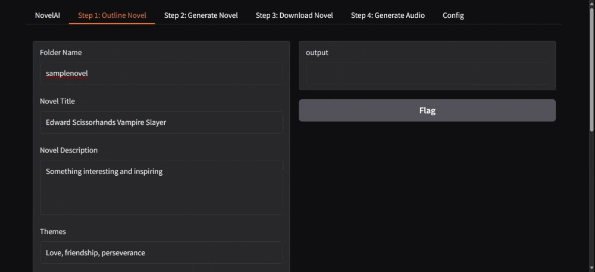

# NovelAI

NovelAI is an open-source project designed to empower would-be authors by leveraging artificial intelligence to create full-length novels. Whether you're a seasoned author or just starting out, NovelAI provides a suite of tools to streamline the novel-writing process, from drafting an outline to generating a finished audiobook.

Note: This is mostly a hobby project of mine, so set expectations accordingly! 

[Sample Novel](books/samplenovel) ([txt](books/samplenovel/book.md), [docx](books/samplenovel/book.docx), [mp3](books/samplenovel/audiobook.mp3))



## Features

### 1. **AI-Powered Novel Outlining**
   - Automatically generate a detailed outline for your novel based on a provided theme, genre, or prompt.
   - Customize the outline structure to fit your storytelling style.

### 2. **Chapter and Scene Planning**
   - Break down your outline into chapters and scenes with AI assistance.
   - Fine-tune the details of each scene, including character interactions, settings, and plot points.

### 3. **Scene Generation**
   - Generate detailed scene drafts based on your outlined structure.
   - Use AI suggestions to enhance descriptions, dialogue, and pacing.

### 4. **Export Options**
   - Convert your novel into a polished Word document for further editing or submission.
   - Generate an audiobook version using AI voice synthesis.

## Installation

You will need Python installed. I document what version I normally use in .python-version, but I think 3.10.x and newer should work. 

1. Clone the repository:
   ```bash
   git clone https://github.com/yourusername/novelai.git
   cd novelai
   ```
   Optional: Setup a [python virtual environment](https://docs.python.org/3/library/venv.html)
2. Install dependencies: (note: you can sometimes just double click on install.sh or install.bat)
   ```bash
   pip install -r requirements.txt
   ```
   Optional: Install additional dependencies to generate audiobooks (python coqui-tts package and ffmpeg for Mac/Windows/Linux)
   ```bash
   pip install -r requirements.audiobook.txt
   brew install ffmpeg
   # cuda support for nvidia cards:
   pip uninstall torch torchaudio
   pip install torch==2.5.1+cu124 torchaudio==2.5.1+cu124 --index-url https://download.pytorch.org/whl/cu124
   ``` 
3. Configure Large Language Model: 
   - By default, it expects you have [LM Studio installed](https://lmstudio.ai/) and [running a server](https://lmstudio.ai/docs/api/server) locally running the lmstudio-community/Meta-Llama-3.1-8B-Instruct-GGUF model. 
   - If this is not the case, such as if you want to use a different model or are using OpenAI's ChatGPT, then edit the configuration in novelai.bat and novelai.sh.
   - You can also enable debug logs by modifying novelai.bat and novelai.sh (based on if you are using windows or mac/linux). 
4. Run the application using novelai.bat or novelai.sh. It will open your web browser automatically. 
   ```bash
   ./novelai.sh
   ```
   ```cmd
   novelai.bat
   ```

## Usage

1. **Start a New Book**:
   - Let the AI generate a novel outline or edit the sample one (copy-pasting the sample book in books director)
   - Provide a theme, genre, or initial idea, as well as any other details that seem relevant (lore, character descriptions, etc)

2. **Refine Your Outline**:
   - Review the outline it generated and edit/tune it as you see fit, or regenerate it if you do not like it (open files in books director in a plain-text editor like notepad or VS Code)
   - Add notes or make edits as needed.

3. **Generate Chapters**:
   - Use AI to draft the outline of each chapter's scenes as well as generate each scene.
   - Generate them all, or generate step-by-step tuning and editing as you go to improve the quality or achieve the desired affect. 

4. **Export Your Novel**:
   - Export your work as Raw Text or a Word document
   - Optional: Generate an audiobook using a fairly sophisticated voice model. 

## Advanced Usage

1. **Customize Templates**
   - You can modify the templates in templates/ to change the behavior when generating outlines
   - You can also set the NOVELAI_TEMPLATES_DIR environment variable to provide different directories of templates. 
2. **Customized Voices**
   - You can customize voices by adding more wav files in voices/ directory.
3. **Customized DocX Theme**
   - modify templates/template.docx to change the default docx theme. 
4. **Command Line Interface**
   - a rich and expressive command line interface is available should you choose to use it to automate common tasks.
   ```bash
   ./novelai.sh --help

   Usage: main.py [OPTIONS] COMMAND [ARGS]...
   
   ╭─ Options ────────────────────────────────────────────────────────────────────────────────────────────────────────────╮
   │ --install-completion          Install completion for the current shell.                                              │
   │ --show-completion             Show completion for the current shell, to copy it or customize the installation.       │
   │ --help                        Show this message and exit.                                                            │
   ╰──────────────────────────────────────────────────────────────────────────────────────────────────────────────────────╯
   ╭─ Commands ───────────────────────────────────────────────────────────────────────────────────────────────────────────╮
   │ start      Start Web UI                                                                                              │
   │ books                                                                                                                │
   │ chapters                                                                                                             │
   │ openai                                                                                                               │
   │ audio                                                                                                                │
   ╰──────────────────────────────────────────────────────────────────────────────────────────────────────────────────────╯
   ```
5. **Functions Library**
   - I've created a number of useful utility functions that you can use for other projects in functions.py
   - I also created an expressive language for building and executing chains of LLM prompts using *just simple jinja2 templates*. For a powerful example, see templates/alt/noveloutline.jinja2.
   - If you are interested in the prompts, it is worth reviewing my approach to getting structured JSON back from any large language model. I have it automatically pass invalid JSON back to the LLM to be corrected (and it works!). 
   - This could easily be used as a starter project for other projects. The command line parameters all use typer and the web user interface uses Gradio. Jinja2 and OpenAI are used to communicate with the large language models. TTS and ffmpeg for audio generation and merging.
   - The command line tools for audiobook generation or making open api calls could be used stand-alone in their own right. They are much simpler that other tools (but also less powerful and slower). 

## AI Techniques and Technologies Used

1. **Prompt Engineering**: I use a number of prompt engineering techniques with the open source [openai libraries](https://platform.openai.com/docs/libraries)
2. **Highly Tuned Prompts**: In many cases, I have had to iterate and tune the prompts to get the desired outcome. I have targeted small language models (7B params) when testing to ensure a wide level of compatibility (what works with small will work better with large!). 
3. **Chain of Thought**: You will note that in the example JSON that I use when generating a novel outline, I actually include extra fields that I never actually use (such as act_list) simply because this prompts the AI to think through details in a certain order. I also in some cases (ex: templates/alt/noveloutline.jinja2) perform a chain of prompts assembling data in one step and then using it in later steps systematically to get the desired result.
4. **N-Shot**: In some cases, I provide multiple examples (see templates/generatechapter.jinja2) to help it to pick up on style and formatting. 
5. **Formatted Responses**: I prompt the LLM to output as JSON providing samples (at times leveraging N-Shot) to get it to output in JSON. Note also that I already start its repsonse with "```json" in many cases so that it will respond with JSON and close the response with tick marks so that I know that it is done and stop receiving more characters.
6. **Text to Speech**: I am using the [TTS library](https://github.com/coqui-ai/TTS) by coqui-ai as well as (by default) its [XTTS-V2](https://huggingface.co/coqui/XTTS-v2) model which seems to provide excellent results. Note that it is unclear what its licensing model will be since coqui seems to have shut down (though its model and tools will live in, I hope). I then leverage [ffmpeg](https://ffmpeg.org/)
7**Automatic JSON clenaup**: I am using the LLM to clean up JSON if it sends back JSON that is invalid. 

## Contributing

We welcome contributions from the community! To contribute:

1. Fork the repository.
2. Create a new branch for your feature or bug fix.
3. Submit a pull request with a detailed explanation of your changes.

## Roadmap

- [ ] Add support for initiating refinements (this is partially completed - see templates/refine director)
- [ ] Continue to refine prompts to generate higher quality content
- [ ] Add support for online editing (right now, you need to open the text files in books/* directories to edit things)
- [ ] Add robust progress tracking while generating content.
- [ ] Expand export options (e.g., EPUB, Kindle formats).
- [ ] More and better labeled voices and voice samples
- [ ] Enhance security and privacy measures for user data (do not run this on the internet - it needs some security hardening to prevent reading/writing files outside of books directory)
- [ ] Generate windows, linux, and mac installers with [PyInstaller](https://pyinstaller.org/en/stable/) or another tool like it. 

## License

This project is licensed under the [Apache License Version 2.0](LICENSE).

## Acknowledgments

Special thanks to the open-source community and all contributors who make this project possible and to the project founder and maintainer [Jacob Beasley](https://www.linkedin.com/in/jacobbeasley/).

---

Ready to create your next masterpiece? Dive into NovelAI and let your creativity flow!
